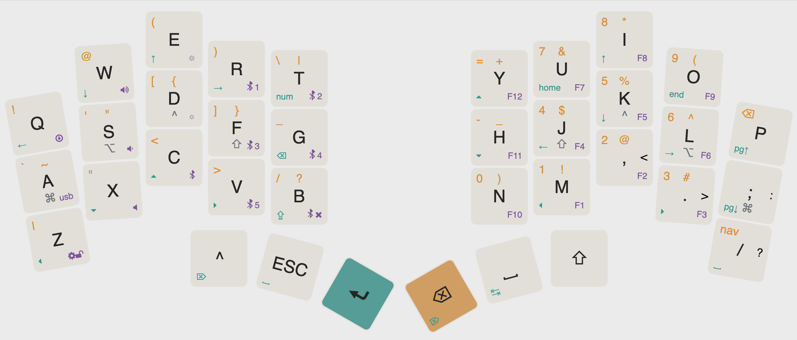

# hector36 ZMK Module

This repository contains the shield files for the [hector36](https://github.com/ezxzeng/hector36) to allow users to build firmware. This can be done by adding the module to the west.yml found in your zmk-config's config directory. There is a full guide available for this here: [ZMK Modules Doc](https://zmk.dev/docs/features/modules). Note: this is after the zephyr 4.1 update.

## Usage

Edit your west.yml file found in your zmk-config's config directory to add the module. Example:

```yaml
manifest:
  remotes:
    - name: zmkfirmware
      url-base: https://github.com/zmkfirmware
    - name: ezxzeng
      url-base: https://github.com/ezxzeng
  projects:
    - name: zmk
      remote: zmkfirmware
      revision: main
      import: app/west.yml
    - name: zmk-keyboards-hector36
      remote: ezxzeng
      revision: main
  self:
    path: config
```
Once you have the module added to your west.yml you can then build firmware as if it was in your config's shield directory or in ZMK main.

note: to enable zmk studio, your build.yaml should look like this:
```yaml
include:
  - board: nice_nano//zmk
    shield: hector36_left
    snippet: studio-rpc-usb-uart
    cmake-args: -DCONFIG_ZMK_STUDIO=y
  - board: nice_nano//zmk
    shield: hector36_right
```

Default keymap is shown below and generated with [keyboard-layout-editor](https://www.keyboard-layout-editor.com/#/gists/3e3b5046810b43f7d344c5cd1094e051):


[homerow mods](https://precondition.github.io/home-row-mods) are are shown in gray, and the purple layer is unlocked by holding down both layer keys. A mouse layer is included but not visualized in the image as it'll get too cluttered.

To build locally:
```bash
west build -p -d build/left -b nice_nano//zmk -S studio-rpc-usb-uart  -- -DSHIELD=hector36_left -DZMK_CONFIG="/workspaces/zmk-config/config" -DZMK_EXTRA_MODULES="/workspaces/zmk-modules/zmk-keyboards-hector36" -DCONFIG_ZMK_STUDIO=y

west build -p -d build/right -b nice_nano//zmk -- -DSHIELD=hector36_right -DZMK_EXTRA_MODULES="/workspaces/zmk-modules/zmk-keyboards-hector36"

west build -p -d build/reset -b nice_nano//zmk -- -DSHIELD=settings_reset
```